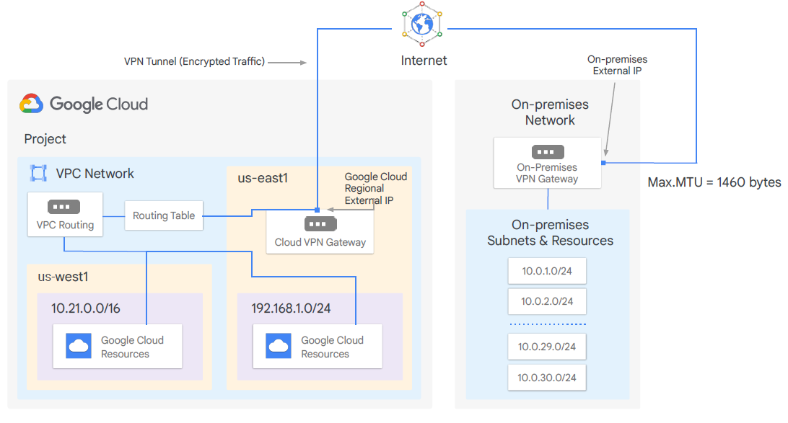
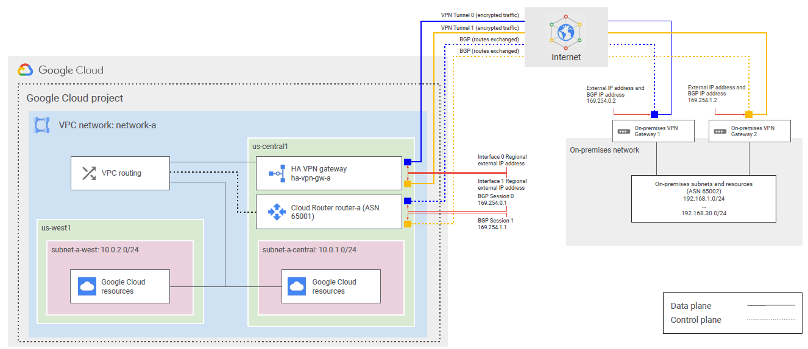
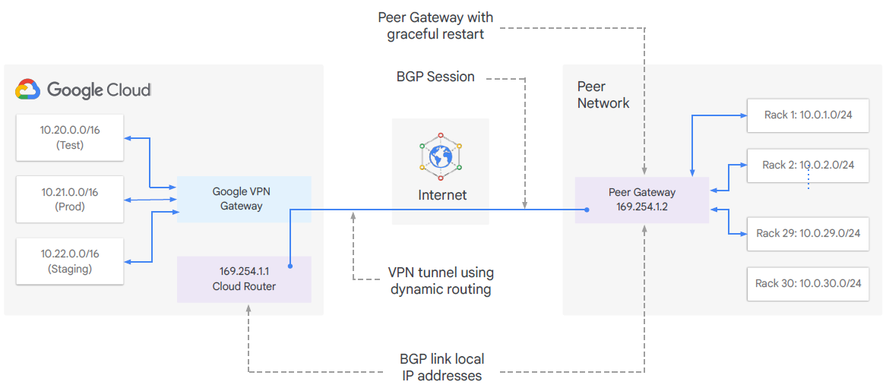
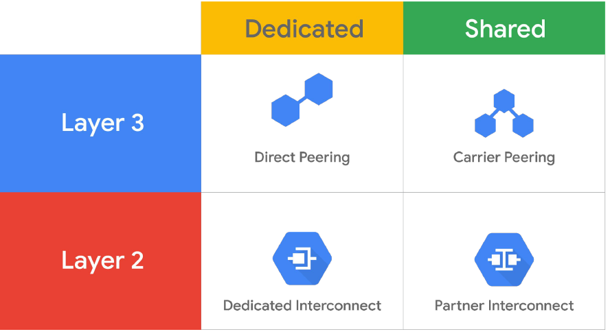
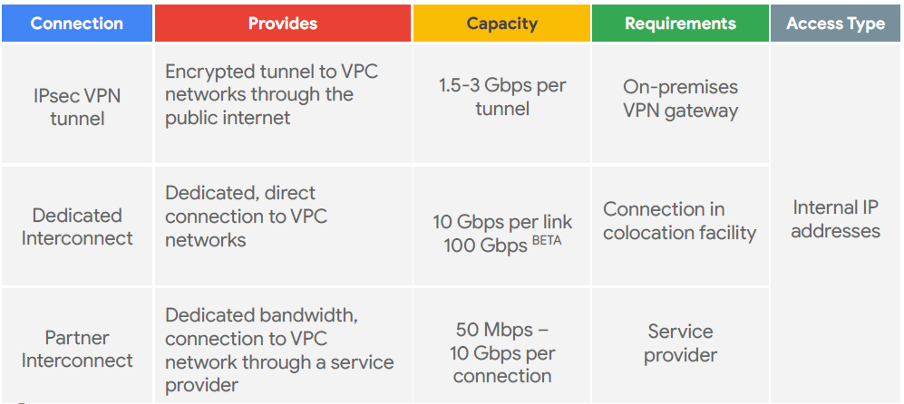
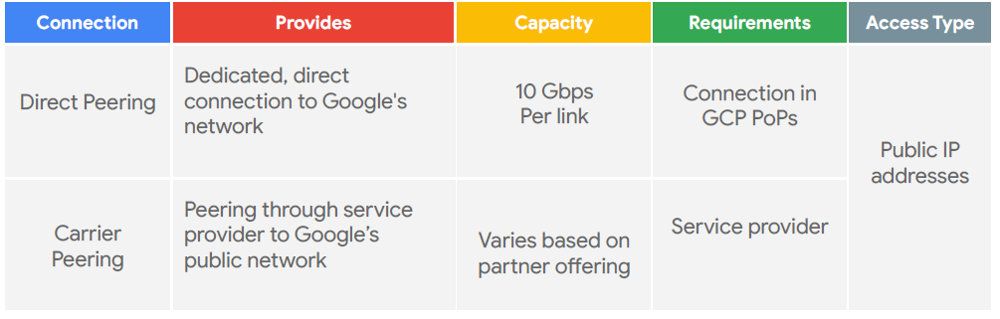
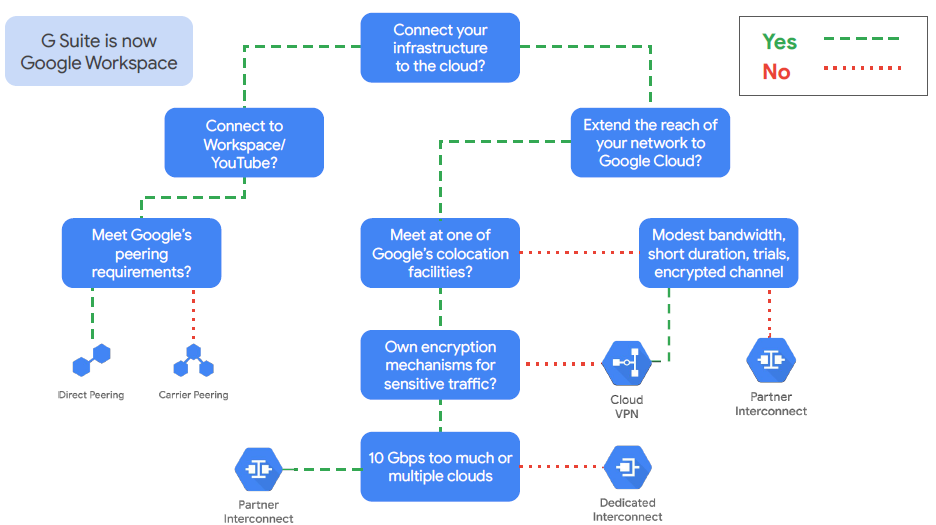
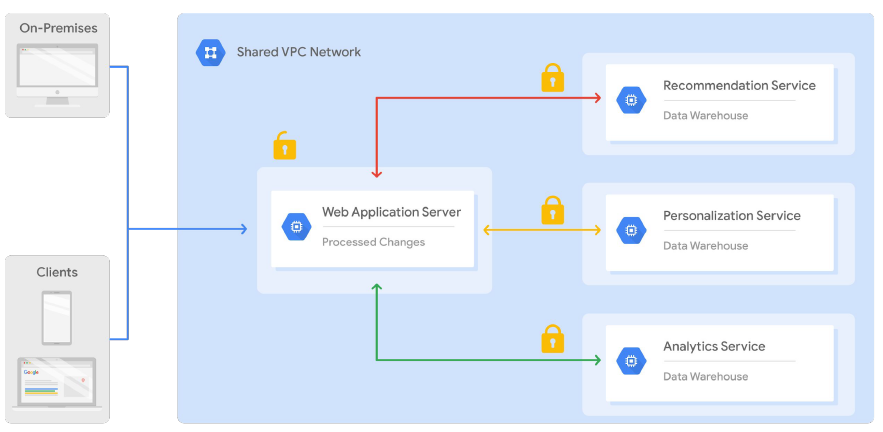
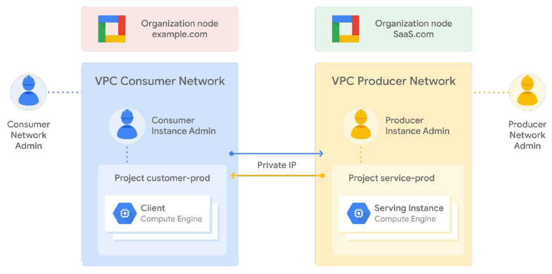

# Interconnecting networks

- Cloud VPN
- Cloud Interconnect and Peering
- Sharing VPC Networks

## Cloud VPN
Cloud VPN securely connects your on-premises network to your Google Cloud VPC network through an IPsec VPN tunnel.

- Useful for low-volume data connections
- 99.9% SLA
- Supports:
    - Site-to-site VPN
    - Static routes
    - Dynamic routes (Cloud Router)
    - IKEv1 and IKEv2 ciphers

## HA VPN
HA VPN is a high availability Cloud VPN solution that lets you securely connect your on-premises network to your Virtual Private Cloud  (VPC) network through an IPsec VPN connection in a single region.

- Provides 99.99% service availability.
- Google Cloud automatically chooses two external IP addresses.
    - Supports multiple tunnels
    - VPN tunnels connected to HA VPN gateways must use dynamic (BGP) routing
- Supports site-to-site VPN for different topologies/configuration scenarios:
    - An HA VPN gateway to peer VPN devices
    - An HA VPN gateway to an Amazon Web Services (AWS) virtual private gateway
    - Two HA VPN gateways connected to each other

### Dynamic routing with Cloud Router

## Cloud Interconnect and Peering

Compare of Interconnect options

### Direct Peering
Direct Peering with Google is done by exchanging BGP routes between Google and the peering entity.

### Carier Peering
If you require access to Google public infrastructure and cannot satisfy Google’s peering requirements, you can connect via a Carrier Peering partner.

## Sharing VPC Networks
- Shared VPC
    
    - in the same organization
    - across projects
    - centralized approach for administration
- VPC network Peering
    
    - for different organization
    - in the same project
    - decentralized approach for administration

