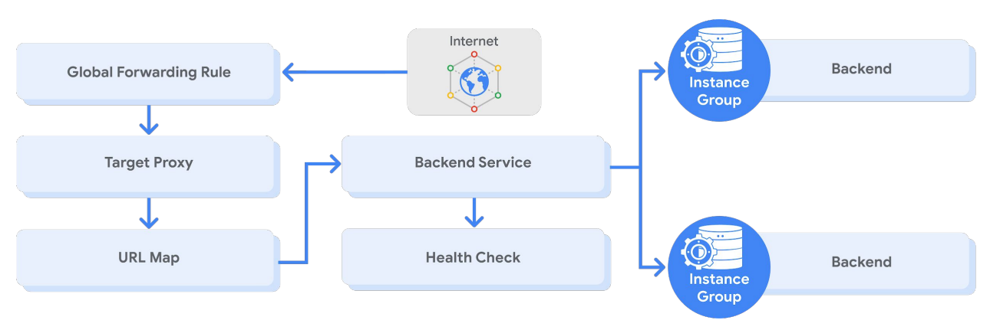

# Load Balancing and Autoscaling

Types
- Global - for globally distributed users
    - HTTP(S)
    - SSL proxy
    - TCP proxy
- Regional - for single region
    - Internal TCP/UDP - uses Andromeda - GCP's software defined network virtualization stack
    - Network TCP/UDP - uses Maglev - a large distributed software system
    - Internal HTTP(S)

## Managed instances group
- based on instance template
- can scale automatically
- can work with LBs
- if an instance crashes it is recreated automadically with the same name and template
- types
    - regiona
    - zonal

To create
- for convenience: 
    - create one machine with persistent disk and do the setup
    - create an image from the disk
    - create a template using that image
- create an instance template
- then create a managed instance group of N specified instances
- types
    - managed - for stateless or statefull
- name
- location
- template
- define autoscale options
- autohealing rules

### Autoscaling and health checks

- Dynamically add/remove instances
    - Autoscaling policies
        - CPU utilization
        - LB capacity
        - Monitoing
        - Queue-based workload

- Healthcheck, similar to uptime check in Stack drive
    - based on this config, GCP computes a health state for each instance
    - health criteria 
        - check interval - how often to check 
        - timeout - how long to wait for a response
        - healthy threshold - how many successgful attempts are decisive
        - unhealthy threshold - how many failed attempts

## HTTP(S) Load Balancing
- Global lb
- Anycast IP address
- support for IPv4 and IPv6
- Autoscaling
- URL maps 
    - one url to some instance, other to other instances 
    - to the closest

Backend services
- Health check (normally round robin)
- Session affinity (optional)
- Time out setting (30sec default, fixed)
- One or more backends
    - an instance group
    - a balancing mode (CPU utilization or RPS)
    - a capacity scaler (celing % of CPU/Rate targets)

balancing mode eg:
- if you want to operate at max 80% CPU
    - set mode to 80
    - set capacity to 100
- if you want to cut instance utilization in half
    - leave mode at 80 % CPU utilization
    - set capacity to 50%
- changes are not instant

### HTTPS
- Target HTTP(S) proxy
- requres at least one SSL certificate (max 15)
    - need a SSL certificate resource
- client SSL session terminates at the load balancer
- support for QUIC trasport layer protocol

**Backend bucket**
- eg. for static

**Network andpoint group (NEG)**
- configuration object that defines backend endpoints or services
- commonly used for deploying services in containers
- can use NEG as backend for some LBS and with Traffic Director
- types
    - Zonal
    - Internet
    - Serverless - points to CLoud Run, App Engine, CLoud Functions
    - Hybrid connectivity
- defined by IP or IP:port

## Cloud CND
- content caching
- over 90 cache sites
 
Cache modes
- USE_ORIGIN_HEADERS - from headers
- CACHE_ALL_STATIC - caches all static that doesn't have no-store, private or no-cache directive
- FORCE_CACHE_ALL - overides caching directives, make sure you don't cache personal content

## SSL proxy load balancing
- Global load balancing for encrypted, non-HTTP traffic
- Terminates SSL session at load balancing layer
- IPv4 or IPv6 clients
- Benefits:
    - Intelligent routing
    - Certificate management
    - Security patching
    - SSL policies

## TCP proxy load balancing
Global load balancing for unencrypted, non-HTTP traffic
- Terminates TCP sessions at load balancing layer
- IPv4 or IPv6 clients
- Benefits:
    - Intelligent routing
    - Security patching

## Network load balancing
- Regional, non-proxied load balancer 
- Forwarding rules (IP protocol data)
-  Traffic: 
    - UDP
    - TCP/SSL ports
- Architecture:
    - Backend service-based 
    - Target pool-based

- only for instances in same region
- suports more ports than TCP proxy and SSL proxy

## Backend service-based architecture
- Regional backend service 
- Defines the behavior of the load balancer and how it distributes traffic to its backend instance groups 
- Enables new features not supported with legacy target pools 
    - Non-legacy health checks 
    - Auto-scaling with managed instance groups 
    - Connection draining 
    - Configurable failover policy

### Target pool-based architecture
- Forwarding rules (TCP and UDP) 
- Up to 50 per project 
- One health check 
- Instances must be in the same region

## Internal TCP/UDP load balancing
- Regional, private load balancing
    - VM instances in same region
    - RFC 1918 IP addresses
- TCP/UDP traffic
- Reduced latency, simpler configuration - inside same VPC
- Software-defined, fully distributed load balancing

## Internal HTTP(S) load balancing
- Regional, private load balancing
    - VM instances in same region
    - RFC 1918 IP addresses
- HTTP, HTTPS, or HTTP/2 protocols
- Based on open source Envoy proxy

**Chosing load balancer**

