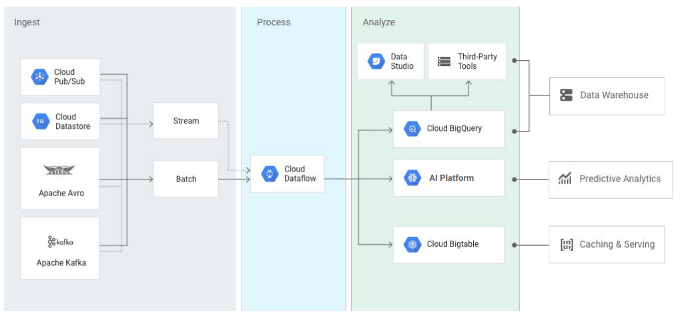
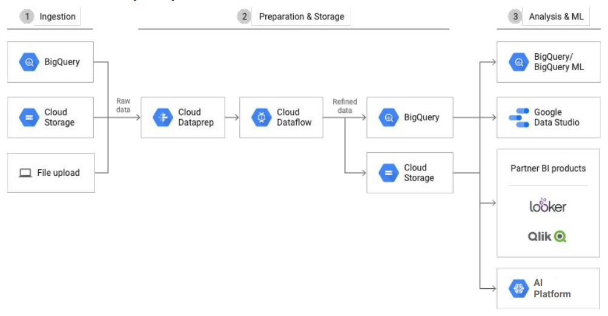
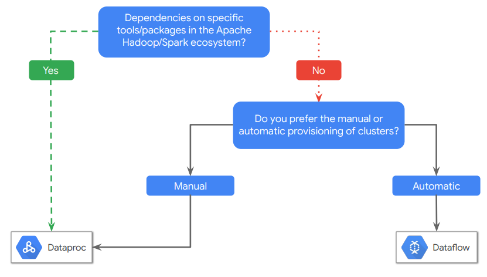

# Managed Services

- BigQuery
- Dataflow
- Dataprep
- Dataproc

## BigQuery
BigQuery is Google Cloud’s serverless, highly scalable, and cost-effective cloud data warehouse 

- Fully managed
- Petabyte scale
- SQL interface
- Very fast

## Cloud Dataflow
Use Cloud Dataflow to execute a wide variety of
data processing patterns

- Serverless, fully managed data processing
- Batch and stream processing with autoscale
- Open source programming using `beam`
- Intelligently scale to millions of QPS

## Cloud Dataprep
Use Cloud Dataprep to visually explore, clean, and prepare data for analysis and machine learning

- Serverless, works at any scale
- Suggests ideal data transformation
- Focus on data analysis
- Integrated partner service operated by Trifacta

## Cloud Dataproc
Cloud Dataproc is a service for running Apache Spark and Apache Hadoop clusters
- Low cost (per-second, preemptible)
- Super fast to start, scale, and shut down
- Integrated with GCP
- Managed service
- Simple and familiar

