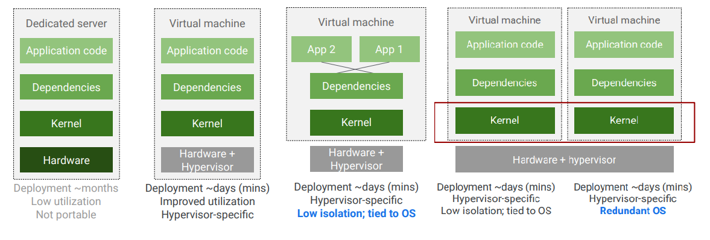
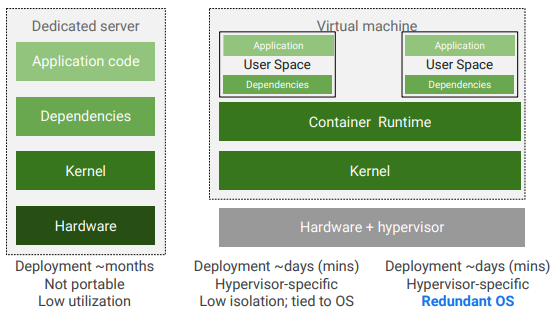
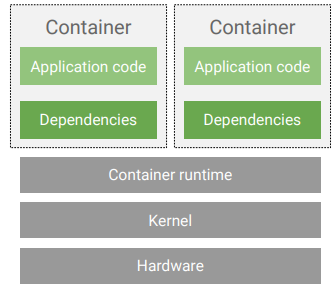
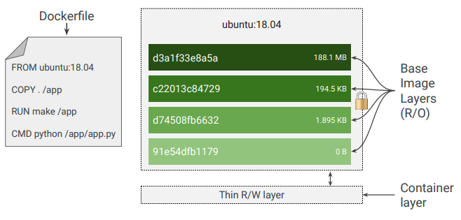
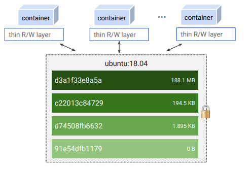
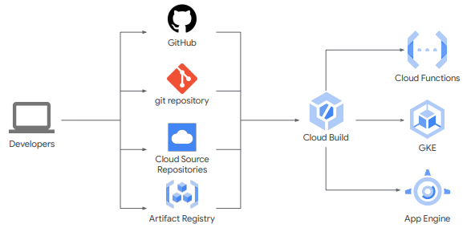

# Google Kubernetes Engine

- Create a container using Cloud Build.
- Store a container in Container Registry.
- Compare and contrast Kubernetes and Google Kubernetes Engine (GKE) features.







Containers are based on a set of technologies
- processes
- linux namespaces - to limit what an app can see
- cgroups - to limit max CPU, mem I/O, other
- union FS - encapsulate apps & dependencies



Container shared images



Cloud Build usage



Cloud Build example
`gcloud builds submit --tag gcr.io/${GOOGLE_CLOUD_PROJECT}/quickstart-image . `

yaml example
```
steps:
- name: 'gcr.io/cloud-builders/docker'
  args: [ 'build', '-t', 'gcr.io/$PROJECT_ID/quickstart-image', '.' ]
images:
- 'gcr.io/$PROJECT_ID/quickstart-image'
```