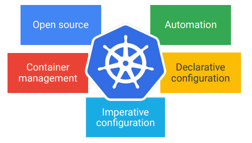

# Kubernetes
 Kubernetes is an open source platform that helps you orchestrate and manage your container infrastructure on-premises or in the Cloud.

- Supports both stateful and stateless applications
    - can store sessions, batch jobs and daemon tasks support
- Autoscaling
- Resource limits
- Extensibility
- Portability

## Google Kubernetes Engine (GKE)

- help you deploy, manage and scale k8s
- fully managed
- container optimized OS
- cluster auto upgrade
- auto repair - vms (nodes)
- cluster scaling
- seamless integration
- integration with IAM
- integrated logging and monitoring
- integrated networking
- cloud console support

## Choosing the best service

- Compute Engine
    - Fully customizable VMs
    - persistent disk and optional local SSDs
    - Global load balancing and autoscaling
    - Per-second billing
    - use cases
        - complete control over the OS or virtual hardware
        - well suited for lift-and-shift migrations to the cloud
        - most flexible compute solutions
        - when a managed solution is too restrictive
- App Engine
    - fully managed, code-first platform
    - streamlines app development and scalability
    - provides support for popular programming languages and application runtimes
    - supports integrated monitoring, logging and diagnostics (Stackdriver - now GC operations suite)
    - simplifies version control and traffic splitting
    - use cases
        - websites
        - mobile app and gaming backends
        - RESTful APIs
- GKE
    - fully managed k8s
    - supports cluster scaling, persistent disks, automated upgrades and auto node repairs
    - build-in integration with GC services
    - portability across multiple environments: hybrid computing, multi-cloud computing
    - use cases
        - containerized apps
        - cloud-native distributed systems
        - hybrid applications
- Cloud Run
    - enable stateless containers
    - stateless
    - fully managed on on your own GKE
    - abstracts away infrastructure management
    - automatically scales up and down
    - charge per usage
    - open api and runtime environment
    - based on Knative
    - usage
        - deploy stateless containers that listen for requests or events
        - build applications in any language using any frameworks and tools
- Cloud Functions
    - Event-driven, serverless compute service
    - single purpose functions
    - automatic scaling with highly available and fault-tolerant design
    - charges apply only when your code runs
    - triggered based on events in GC services, HTTP endpoints and Firebase
    - use cases
        - supporting microservice architecture
        - serverless application backends: mobile, IOT, integrate with 3rd party services and APIs
        - intelligent apps
            - virtual assistant and chat bots
            - video and image analysis
