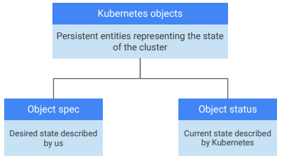
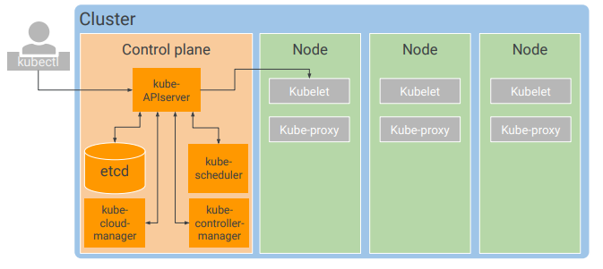

# Kubernetes Architecture

- Kubernetes Concepts
- Kubernetes Components
- Google Kubernetes Engine Concepts
- Object Management
- Migrate for Anthos

## Kubernetes Concepts
- objects - persistent + attributes + state
- declarative management - what you want the state of the objects to be
- watch loop - how it makes sure the objects are kept in the desired state

### POD 
- the basic building blocks
- smallest deployable k8s object
- can have one or more containers
- more containers should be tightly coupled and share resources (networking and storage)
- has an unique IP
- containers in the same host can communicate through localhost (127.0.0.1)
- don't heal themselves

## Kubernetes Components

- Control Plane - coordinate the entire cluster
    - `kube-APIserver`
        - accepts commands that view and change objects
        - auth, admission control
        - accessed by `kubectl` and the rest of the components
    - `etcd`
        - clusters database
        - store the state
        - configuration data
        - dynamic data: cluster config, running pods, etc.
    - `kube-scheduler`
        - schedules pods onto nodes
        - checks the requirements and available resources
        - not starts the pods, just marks the node it should run on
        - obey constraints
        - resources limits, affinity rules
    - `kube-controller-manager`
        - when the desired state is different than the existent state will try to make changes to fix this
        - loops of code (controllers) that handle the process of re-mediation
    - `kube-cloud-manager`
        - manages controllers that interact with the underlying cloud providers
    - `kubelet`
        - is an agent of k8s on each node
        - uses the container runtime to start a pod and monitors its life cycle
        - `APIserver` connects to the `kubelet` to start a node
    - `kube-proxy`
        - uses iptables to maintain network connectivity among the pods in the cluster

- `kubectl` - cli tool to control
- `kubeadm` - tool to administer the cluster

### GKE Architecture
- simpler perspective for user
- manages all of the control plane components for us
- exposes an IP address to send the k8s API requests
- manage nodes - add and configure easily
- node pools 
    - share configuration like amount of memory or CPU generation
    - lets you ensure that workloads run on the desired hardware
    - can be labeled
- some of the memory and CPU will be reserved GKE and Kubernetes
- clusters types
    - zonal - all cluster nodes  are in the same zone, has issues if the zone fails
    - regional
        - control planes and nodes spread through the region
        - can withstand the less or more zones, but not all
        - default: spread across 3 zones, each with 1 control plane + 3 nodes
        - the same number of nodes in each zone
- can't convert zonal to regional and vice versa
- clusters can be private
    - not accessible from the internet
    - accessible from other GCP services
    - accessible from authorize networks
