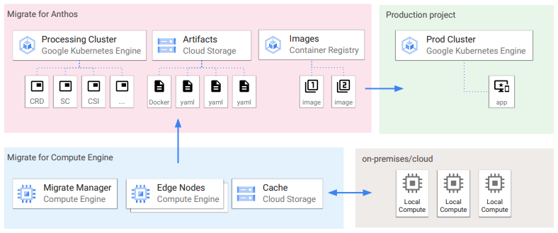
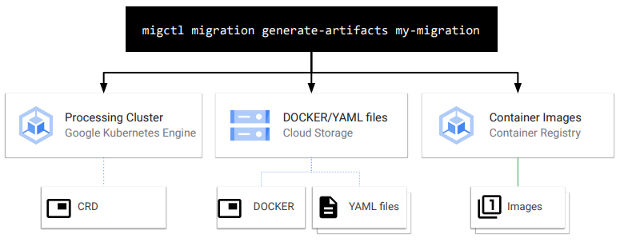

# Migrate for Anthos

- Move and convert workloads into containers
- workloads can start as physical servers or VMs
- Move workload compute to container immediately (<10min)
- data can be migrated all at once or "streamed" to the cloud until the app is live in the cloud.

1. Configure processing cluster
2. Add migration source
3. Generate and review plan
4. Generate artifacts
5. Test
6. Deploy

