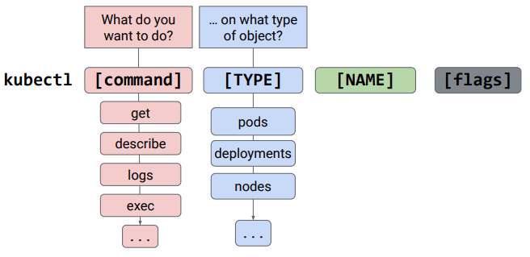

# Kubernetes Workloads

## kubectl

- utility used by administrators to control Kubernetes clusters
- transforms command line entries to API calls for the `kube-APIserver`
- needs credentials to connect
- needs a config file in `$HOME/.kub/config`
    - target cluster name
    - credentials for clusters
- Current config: `kubectl config view` - about `kubectl`, not the cluster
- Get credentials: `gcloud container clusters get-credentials [CLUSTER_NAME] --zone [ZONE_NAME]`



Examples
- kubectl get pods -o=wide
- kubectl get pod my-test-app -o=yaml

With `kubectl` you can:
- create k8s objects
- view objects
- delete objects
- view and export config

First time you should configure `kubectl`
Use `--kubeconfig` or `--context` so you select the cluster you intend to use for each command

## Deployments
High level Controller that describes a desired state of pods.
- uses ReplicaSet for the number of pods
- uses two ReplicaSet for rolling out updates
- useful for stateless application
- eg: frontend


```
apiVersion: apps/v1
kind: Deployment
metadata:
    name: my-app
spec:
    replicas: 3
    template:
        metadata:
            labels:
            app: my-app
    spec:
        containers:
        - name: my-app
            image: gcr.io/demo/my-app:1.0
            ports:
            - containerPort: 8080
```

### States
- In progress - changes in progress
- Complete - changes are done
- Failed - creation couldn't be completed
    - couldn't pull images
    - not enough resources
    - missing permissions

### Create deployments
- declaratively - `kubectl apply -f [DEPLOYMENT_FILE]`
- imperatively - `kubectl run ...`
- GKE workloads menu
    - specify container image, environment variables, initialization commands
    - select namespaces, add labels
    - van view resulting YAML manifest

### Inspect deployments
- `kubectl` get / describe
    - `kubectl get deployment [DEPLOYMENT_NAME]`
    - `kubectl describe deployment [DEPLOYMENT_NAME]`
    - `-o yaml > result.yaml` to get the resulted yaml file
- GKE interface

### Autoscale deployment
```
kubectl autoscale deployment [DEPLOYMENT_NAME]  \n
--min=5 --max=8 --cpu-percent=80`
```

### Update deployment
- `kubectl apply -f [DEPLOYMENT_FILE]`
- `kubectl set image deployment [DEPLOYMENT_NAME] [IMAGE] [IMAGE]:[TAG]`
- `kubectl edit  deployment/[DEPLOYMENT_NAME]`
    - edit with vi
    - at save updates
- GKE interface


### Services
- Blue Green Deployments
    - deploy a new version and ensure services remain available while updating
    - creates a completely new deployment in parallel
    - when is done the traffic is switched to the new deployment
    - the old deployment is deleted
    - switch is instantaneous
    - you need double resources
    - 
- Cannary Deployments
    - gradually shift to the new version
    - minimize the excess resource usage during updates
    - issues can be identified before done 100%
    - selector is based on a label, not a version
    - 
    - ```
        kubectl apply -f my-app-v2.yaml
        kubectl scale deploy/my-app-v2 –replicas=10
        kubectl delete -f my-app-v1.yaml
    ```
    - could have issues because client requests not always get to the same pod
    - can use `sessionAffinity` to `ClienIP` to fix this
- A/B testing
    - test a hypotesis by using variant implementations
    - filter by HTTP headers, geolocation, OS
    - measure and compare versions then decide what version was best
    - will not see the performance improvements
- Shadow testing
    - deploy a new version hidden from users
    - an incoming request is mirrored and replayed in the test environment
    - this process can happen either real time / asynchronously
    - no impact on production
    - can measure of service against production
    - reduced deployment issues
    - can combine with Cannary reployments

Choose the proper release


### Rolling back a Deployment
- `kubectl rollout undo deployment [DEPLOYMENT_NAME]`
- `kubectl rollout undo deployment [DEPLOYMENT_NAME] --to-revision=2`
- `kubectl rollout history deployment [DEPLOYMENT_NAME] --revision=2`

- default Cleanup strategy: last 10 deployment history kept
- pause deployments `kubectl rollout pause deployment`
- resume deployments - changes rollout with a single revision
- monitor status `kubectl rollout status deployment`
- delete deployment - `kubectl` or interface

