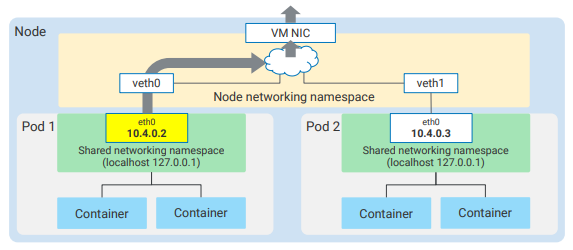
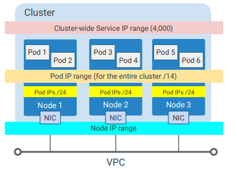

# Pod Networking

- A Pod is a group of containers with shared storage and networking
- uses `IP-per-pod` model of k8s
- each Pod has a single IP
- each container in the Pod share the same network namespace
- two container in the same Pod will talk via localhost (127.0.0.1)

- each Pod has a unique IP address, just like a host on the network

- two Pods on the same node talk via the node's root network namespace that is connected to the node's primary NIC
- GKE assign subnet IPs to the nodes (Compute VMs)
- VPC-native GKE clusters
    - create an Alias IP range to reserve 4000 IP addresses for cluster-wide Services that you may create later
    - create a separate Alias IP range for your Pods
    - allocates /24 ranges per node (250 IP addresses)
    - this allows for 1000 nodes with overrunning 100 Pods each by default 
 