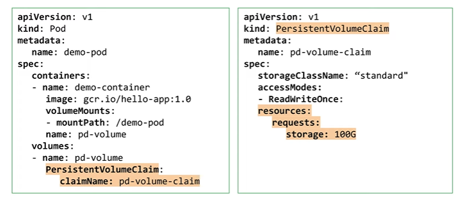

# Volumes

- k8s offers storage abstractions options
- Volumes
    - a directory accessible to all containers in a Pod
    - some volumes are ephemeral
    - some volumes are persistent
- `PersistentVolumes`
    - manage durable storage
    - typically backed by persistent disks
    - you can use solutions like NFS (Filestore in GC)
    - managed by kubernetes
    - exist independently from Pods
    - provisioned through `PersistentVolumeClaims` or explicitly created by a cluster admin
        - specify size, access mode and storage class
    - GCP storage classes are different from k8s storage classes

- Ephemeral volume types explained
    - emptyDir
        - shares the Pod's lifecycle
        - k8s uses local disks or memory backed files for this
        - data will be deleted when the container is removed
        - data is safe if the container crashes
    - ConfigMap
        - object can be referenced in a volume like a tree of files
        - e.g. for a webserver config file
    - Secrets
        - store sensitive info like passwords
    - downwardAPI
        - make data about Pods available to containers
        - e.g. useful for an identifier guaranteed unique in the cluster
    
```
apiVersion: v1
    kind: Pod
    metadata:
        name: web
spec:
    containers:
    - name: web
        image: nginx
        volumeMounts:
        - mountPath: /cache
            name: cache-volume
    volumes:
    - name: cache-volume
        emptyDir: {}
``




