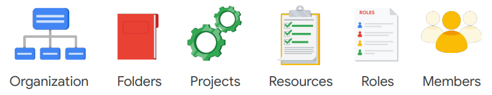
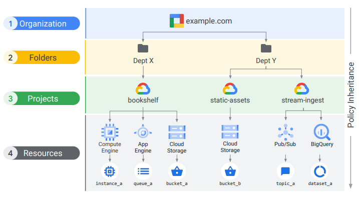
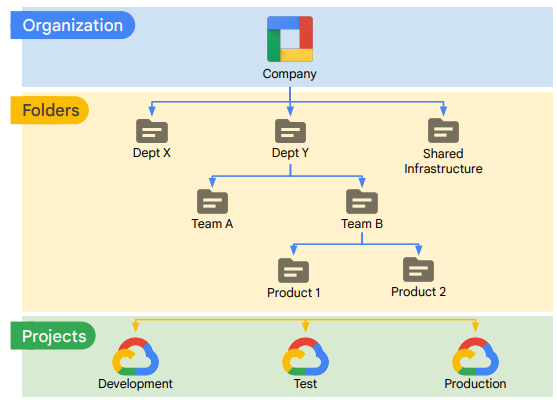
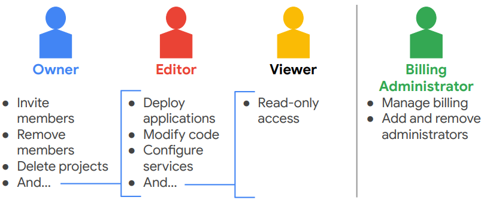
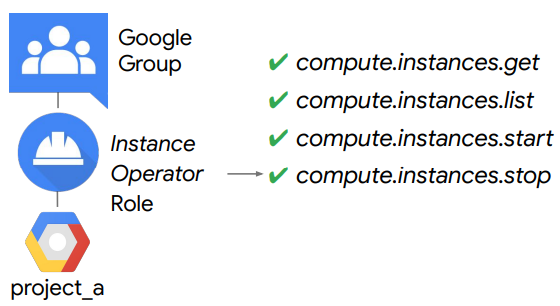

# IAM

**Agenda**
- Identity and Access Management (IAM)
- Organization
- Roles
- Members
- Service accounts
- IAM best practices

IAM is a way to identify WHO can do WHAT on WHICH resource

### IAM Objects

### IAM resource hierarchy

## Organization node
- the root node for the GC resources
- Organization roles
    - Organization Admin: Control over all resources - good for auditing
    - Project Creator: Controls project creation

### Creating and managing Organizations
- closely associated with a Google Workspace or Cloud Identity account
- Super admin
    - Assign the Organization admin role to some users 
    - Be the point of contact in case of recovery issues
    - Control the lifecycle of the Workspace or Cloud Identity account and Organization resource
- [Organization admin](https://cloud.google.com/resource-manager/docs/creating-managing-organization#adding_an_organization_admin):
    - Define IAM policies 
    - Determine the structure of the resource hierarchy 
    - Delegate responsibility over critical components such as Networking, Billing, and Resource Hierarchy through IAM roles
    - NOT including - perform other actions like: create folders (least privilege principle)
    - can assign itself other roles

## Folders
- additional grouping
- use for:
    - different legal entities
    - departments
    - teams
- folders allow delegation of administration rights

### Resource manager roles

## Roles
- Roles are collections of permissions
- Types
    - Basic
        - apply to all GC services in a project
        - broad
        - affect all resources
        - 
    - Predefined
        - apply to a particular GCP service in a project
        - include more fine-grained permissions on the particular service
        - roles are meant to represent abstract functions  and are customized to align with real jobs.
        - top roles:
            - [Compute](https://cloud.google.com/compute/docs/access/iam#iam_roles) Admin - Full control of all Compute Engine resources (compute.*)
            - Network Admin - Permissions to create, modify, and delete networking resources, except for firewall rules and SSL certificates
            - Storage Admin - Permissions to create, modify, and delete disks, images, and
snapshots
    - Custom
        - example for a role that allows "least-privilege" model:
        - 
