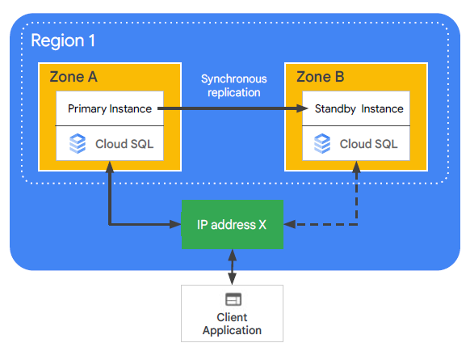
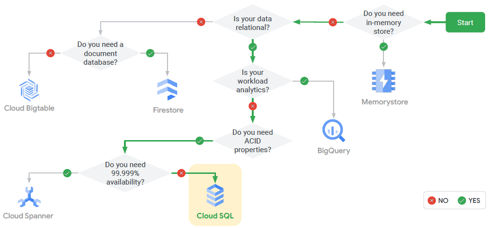

# Cloud SQL

Cloud SQL is a fully managed database service (MySQL, PostgreSQL, or Microsoft SQL Server)

Patches and updates automatically applied
- You administer MySQL users
- Cloud SQL supports many clients
    - gcloud sql
    - App Engine, Google Workspace scripts
    - Applications and tools
        - SQL Workbench, Toad
        - External applications using standard MySQL drivers

Performance:
- 64 TB of storage
- 60,000 IOPS
- 624 GB of RAM
- Scale out with read replicas
Choice:
- MySQL 5.6, 5.7 (default), or 8.0
- PostgreSQL 9.6, 10, 11, 12, 13 (default), or 14
- Microsoft SQL Server 2017 or 2019 (Standard default)

Cloud SQL services
- HA configuration
- Backup service
- Import/export
- Scaling
    - Up: Machine capacity
    - Out: Read replicas

