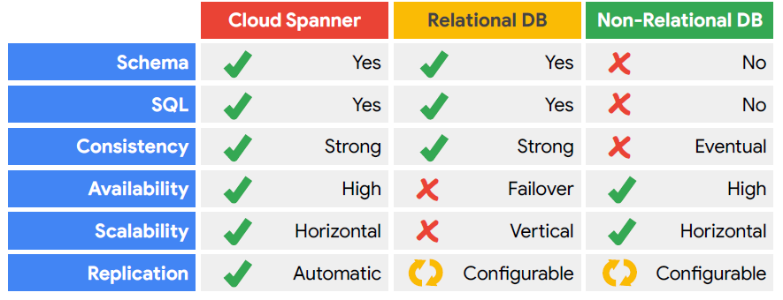
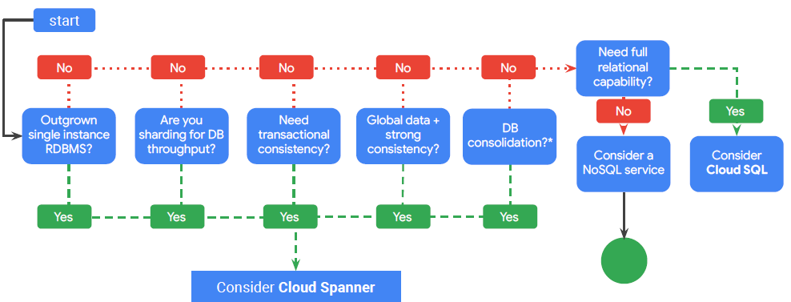
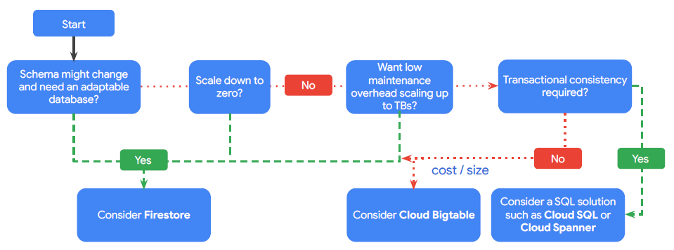
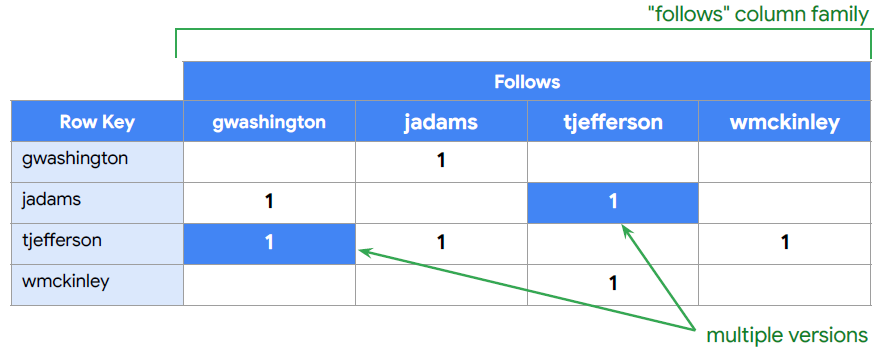
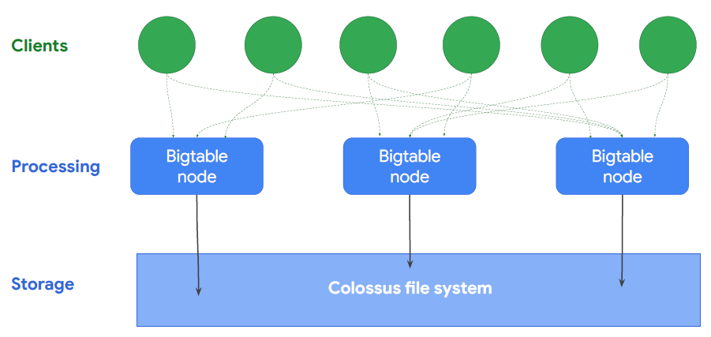
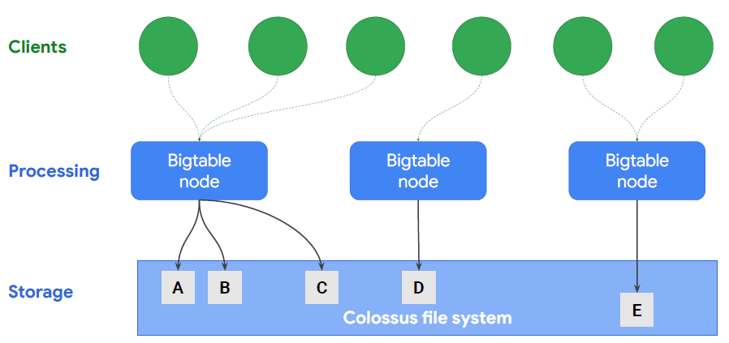
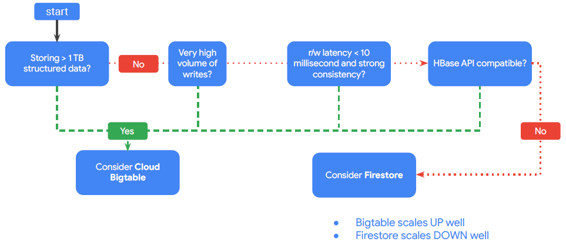

# Cloud Spanner
Cloud spanner is a relational database service with transactional consistency, global scale and high availability

- Scale to petabytes
- Strong consistency
- High availability
- Used for financial and inventory applications
- Monthly uptime
    - Multi-regional: 99.999%
    - Regional: 99.99%

# Firestore

Firestore is a fully managed NoSQL document database
- Simplifies storing, syncing, and querying data
- Mobile, web, and IoT apps at global scale
- Live synchronization and offline support
- Security features
- ACID transactions
- Multi-region replication
- Powerful query engine

Datastore mode (new server projects):
- Compatible with Datastore applications
- Strong consistency
- No entity group limits
Native mode (new mobile and web apps):
- Strongly consistent storage layer
- Collection and document data model
- Real-time updates
- Mobile and Web client libraries

# Cloud BigTable
Is a fully managed NoSQL wide-column database;

- Petabyte-scale
- Consistent sub-10ms latency
- Seamless scalability for throughput
- Learns and adjusts to access patterns
- Ideal for Ad Tech, Fintech, and IoT
- Storage engine for ML applications
- Easy integration with open source big data tools

## Storage model

## Access patterns

Learns access patterns

Smalest cluster
- 3 nodes
- can handle 30k operations

# MemoryStore
MemoryStore is a fully managed Redis service

- In-memory data store service
- Focus on building great apps
- High availability, failover, patching, and monitoring
- Sub-millisecond latency
- Instances up to 300 GB
- Network throughput of 12 Gbps
- Easy Lift-and-Shift

