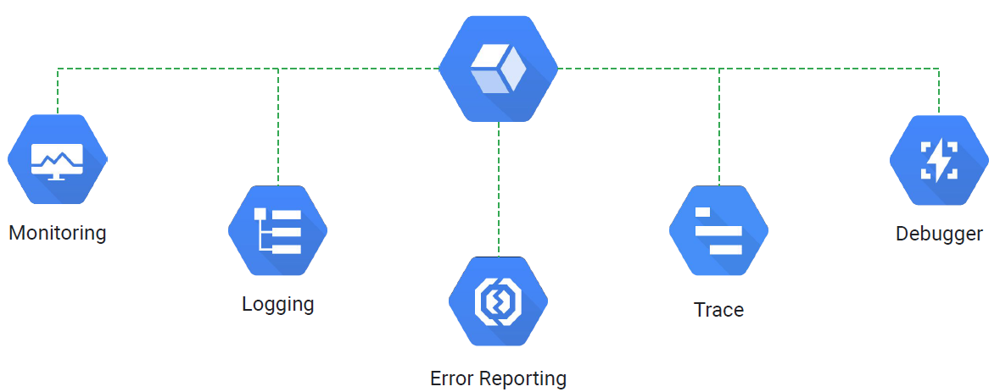

# Resource Monitoring

- Monitoring
- Lab
- Logging
- Error Reporting
- Tracing
- Debugging

## Stack Driver
- Integrated monitoring, logging, diagnostics
- Manages across platforms
    - Google Cloud and AWS
    - Dynamic discovery of Google Cloud with smart defaults
    - Open-source agents and integrations
- Access to powerful data and analytics tools
- Collaboration with third-party software

### Monitoring
- Dynamic config and intelligent defaults
- Platform, system, and application metrics
    - Ingests data: Metrics, events, metadata
    - Generates insights through dashboards, charts, alerts
- Uptime/health checks
- Dashboards
- Alerts

Alerts Best Practices
- Monitor symtoms
- Use multiple nitification channels
- Customize alerts
    - Specify actions to be taken
    - Resources need to be examined
- Avoid noise

- Uptime checks
- Should install Monitoring agent (included in your startup script)
- Can create custom metrics

### Logging
Cloud Logging allows you to store, search, analyze, monitor, and alert on log data and events from Google Cloud and AWS. It is a fully managed service that performs at scale and can ingest application and system log data from thousands of VMs.

- Platform, systems, and application logs
    - API to write to logs
    - 30-day retention
- Log search/view/filter
- Log-based metrics
- Monitoring alerts can be set on log events
- Data can be exported to Cloud Storage, BigQuery, and Pub/Sub

### Error Reporting
Error Reporting counts, analyzes, and aggregates the errors in your running cloud services.
A centralized error management interface displays the results with sorting and filtering capabilities, and you can even set up real-time  notifications when new errors are detected.

Aggregate and display errors for running
cloud services
- Error notifications
- Error dashboard
- App Engine, Apps Script, Compute Engine, Cloud Functions, Cloud Run, GKE, Amazon EC2
- Go, Java, .NET, Node.js, PHP, Python, and Ruby

### Tracing
Cloud Trace is a distributed tracing system that collects latency data from your applications and displays it in the Cloud Console

Tracing system
- Displays data in near real–time
- Latency reporting
- Per-URL latency sampling
Collects latency data
- App Engine
- Google HTTP(S) load balancers
- Applications instrumented with the Cloud Trace SDKs

### Debugging
Cloud Debugger is a feature of Google Cloud that lets you inspect the state of a running application, in real time, without stopping or slowing it.
Specifically, the debugger adds less than 10ms to the request latency when the application state is captured. In most cases, this is not noticeable by users.

- Inspect an application without stopping it or slowing it down significantly.
- Debug snapshots:
    - Capture call stack and local variables of a running application.
- Debug logpoints:
    - Inject logging into a service withoutstopping it.
- Java, Python, Go, Node.js, Ruby, PHP, and .NET Core

