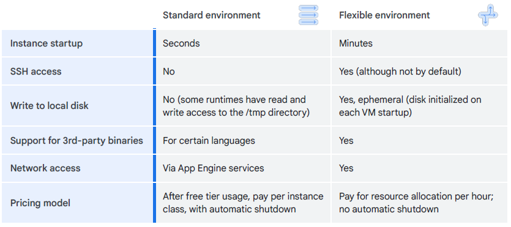

# Applications in the Cloud

## App Engine
A fully managed, serverless platform for developing and hosting web applications at scale

- choose from popular languages, libraries, frameworks
- automatically provision servers
- scale app instances based on demand
- code where you want: Eclipse, IntelliJ, Maven, PyCharm, Git, Jenkins
- no servers to provision or maintain
- built-in services and APIs:
    - NoSQL datastores
    - Memcached
    - load balancing
    - health checks
    - application logging
    - user auth API
- SDKs - develop, deploy manage apps
    - APIs and libraries
    - sandbox environment - local
    - deployment tools
- use web UI
    - create new applications
    - configure domain names
    - change which version is live
    - examine access and error logs
- Security Command Center
    - keeps web app sage
    - scan automatically common vulnerabilities

### Standard Environment
- standardize list of languages and libraries
- persistent storage with queries, sorting and transactions
- automatic scaling and load balancing
- async task queues for performing work outside the scope of a request
- scheduled tasks for triggering events at specified times or regular intervals
- integration with other Google Cloud Services and APIs

Requirements
- specified versions of: Java, Python, PHP, Go, Node.js and Ruby
- applications must conform to sandbox constraints that are dependent on runtime
- apps run in a secure sandbox env - easy scale

Standard environment steps
- develop web app and test locally
- develop to App Engine with SDK
- App Engine scales and services the app

### Flexible environment
- can specify the type of container
- runs in Docker containers in Compute Engine
- manages Compute Engine VMs
    - health-checked, healed and co-located
    - critical, backward-compatible updates are automatically applied to the underlying OS
    - VM instances are automatically located by geographical region according to the settings in your project
    - VM instances are restarted on a weekly basis
- support for
    - microservices
    - authorization
    - SQL & NoSQL databases
    - traffic splitting
    - logging
    - search
    - versioning
    - security scanning
    - Memcached
    - CDN
- benefit from custom configuration and libraries, while focusing on writing code
- customize runtime and OS of your virtual machine
    - standard runtimes: Python, Java, Go, Node.js, PHP, .NET and Ruby
- customize or provide runtimes by supplying a custom Docker image or `Dockerfile`

App Engine vs GKE
- App Engine's standard environment is for people who want the service to take maximum control of their web and mobile application’s deployment and scaling.
- Google Kubernetes Engine, however, gives the application owner the full flexibility of Kubernetes
- App Engine's flexible environment is somewhere between the two.

## Cloud Endpoints and Apigee Edge

APIs
- a clean, well-defined interface
- underlying implementation can change
- changes to the API are made with versions

### Cloud Endpoints 
Cloud Endpoints is a distributed API management system that uses a distributed Extensible Service Proxy, which is a service proxy that runs in its own Docker container.
- API console, hosting, logging, monitoring, and other feature
- use with any APIs that support the OpenAPI specification
- supports applications running in APpEngine, GKE and Compute Engine
- clients include Android, iOS and JavaScript

### Apigee Edge
- specific focus on business problems, like rate limiting, quotas, and analytics.
- often used to provide a software services to other company
- backend services for Apigee Edge don't need to be in Google Cloud
- you can use it to replace a large app in one move then peel of its services individually

## Cloud Run
A managed compute platform that can run stateless containers
- serverless, removing the need for infrastructure management
- built on `Knative`, an open API and runtime env built on K8s
- Can automatically scale up and down from zero almost instantaneously, charging only for the resources used

Workflow
- write you app - listen for web requests
- build and package
- push to Artifact Registry
- Deploy to Cloud Run
- get unique http URL

Workflow types
- source code -> `Buildpacks` -> Container image -> Web app
- source code + container

- your app is exposed via https on the run.app domain or your own domain
- pricing model
    - granularity of 100ms
    - count: startup + handle requests + shut down time
    - small fee every one million requests you serve
- can allocate up to 4vCPU & 8GB
- can run any binary, as long as it's compiled for Linux sixty-four bit
- can run apps in:
    - popular: Java, Python, Node.js, PHP, Go, C++
    - less popular: Cobol, Haskell, Perl etc.
    - as long as your app handles web requests

