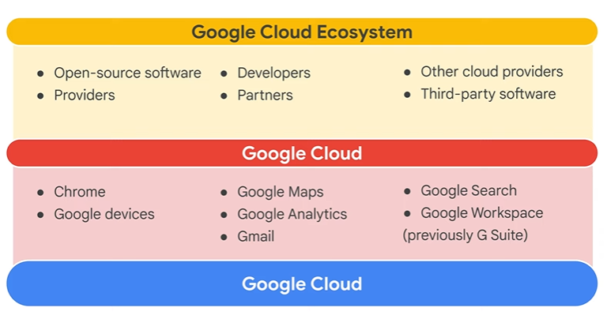
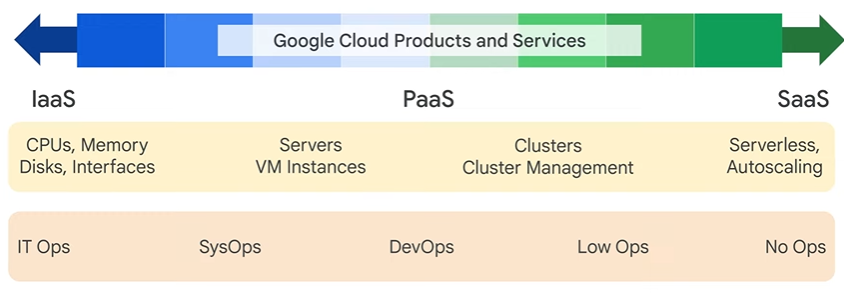
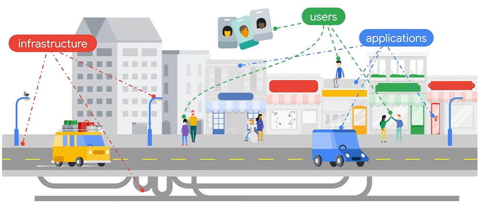

# Core Infrastructure

- [Identity and Access Management (IAM)](10.Identity-Access-Management.md)
- [Data Storage Services](20.Storage-and-Database-Services.md)
- [Resource Management](30.Resource-Management.md)
- [Resource Monitoring](40.Resource-Monitoring.md)

## Google Ecosystem

## Google Services

## Infrastructure - Applications - Clients
