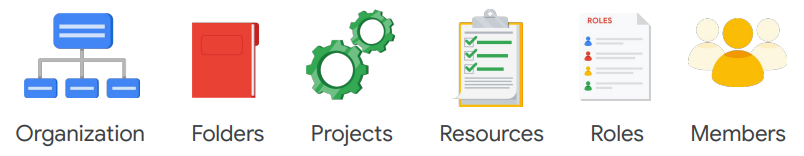
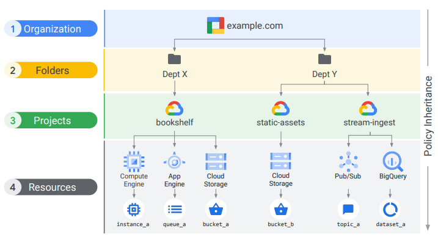
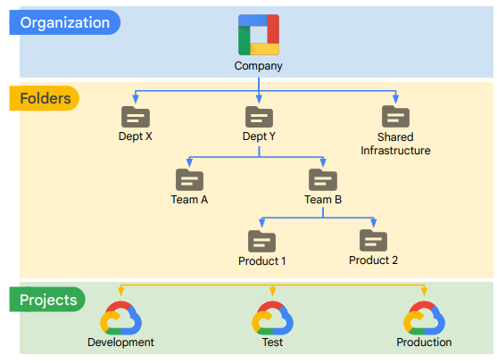
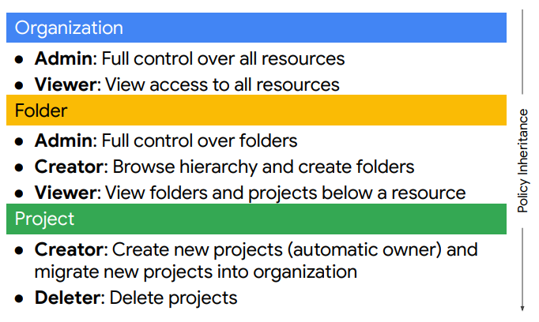
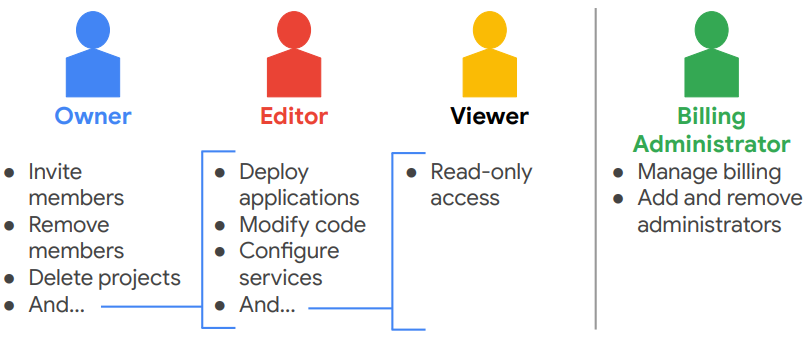
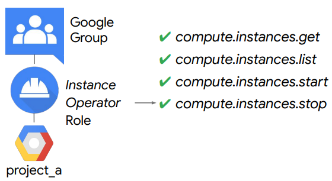
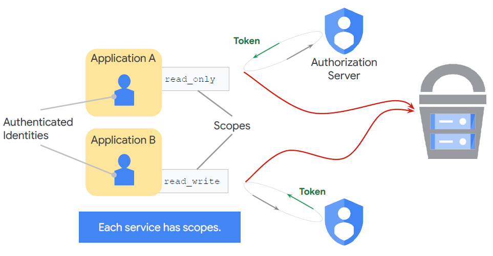
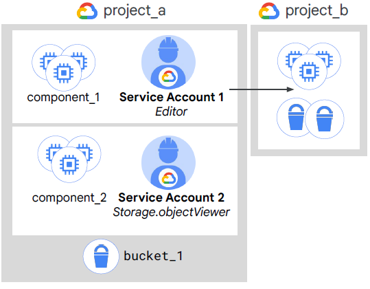

# IAM

**Agenda**
- Identity and Access Management (IAM)
- Organization
- Roles
- Members
- Service accounts
- IAM best practices

IAM is a way to identify WHO can do WHAT on WHICH resource

### IAM Objects

### IAM resource hierarchy

## Organization node
- the root node for the GC resources
- Organization roles
    - Organization Admin: Control over all resources - good for auditing
    - Project Creator: Controls project creation

### Creating and managing Organizations
- closely associated with a Google Workspace or Cloud Identity account
- Super admin
    - Assign the Organization admin role to some users 
    - Be the point of contact in case of recovery issues
    - Control the lifecycle of the Workspace or Cloud Identity account and Organization resource
- [Organization admin](https://cloud.google.com/resource-manager/docs/creating-managing-organization#adding_an_organization_admin):
    - Define IAM policies 
    - Determine the structure of the resource hierarchy 
    - Delegate responsibility over critical components such as Networking, Billing, and Resource Hierarchy through IAM roles
    - NOT including - perform other actions like: create folders (least privilege principle)
    - can assign itself other roles

## Folders
- additional grouping
- use for:
    - different legal entities
    - departments
    - teams
- folders allow delegation of administration rights

### Resource manager roles

## Roles
- Roles are collections of permissions
- [Types](https://cloud.google.com/iam/docs/understanding-roles)
    - Basic
        - apply to all GC services in a project
        - broad
        - affect all resources
        - 
    - Predefined
        - apply to a particular GCP service in a project
        - include more fine-grained permissions on the particular service
        - roles are meant to represent abstract functions  and are customized to align with real jobs.
        - top roles:
            - [Compute](https://cloud.google.com/compute/docs/access/iam#iam_roles) Admin - Full control of all Compute Engine resources (compute.*)
            - Network Admin - Permissions to create, modify, and delete networking resources, except for firewall rules and SSL certificates
            - Storage Admin - Permissions to create, modify, and delete disks, images, and
snapshots
    - Custom
        - example for a role that allows "least-privilege" model:
        - 

## Service accounts
A service account is an account that belongs to your application instead of to an
individual end user. This provides an identity for carrying out server-to-server
interactions in a project without supplying user credentials.

### Built-in
- Compute Engine and App Engine default service accounts
    - Google APIs service account
    - 123845678986-compute@project.gserviceaccount.com
    - By default, enabled on all instances created using gcloud or the Google Cloud console
- Runs internal Google processes on your behalf, has Editor Role
    - project-number@cloudservices.gserviceaccount.com

### Scopes

- can be customized when creating a VM, a legacy method - use roles now

- can be used as resources - an grant access to users/roles **Service account user role**

- can design permissions without recreating VMs
- Cloud IAM lets you slice up a project into different microservices, each with access to different resources by creating service accounts to represent each one.

**Types of Google Service Accounts**
- Google managed
- User-managed
    - up to 10 keys per service account - to facilitate rotation
    - you can't recover them from google
    - should be used as the last resource, consider:
        - short-lived service account credentials (tokens)
        - service account impersonation
    - `gcloud iam service-accounts keys list --iam-account user@email.com`

### IAM Best practices
- Use projects to group resources that share the same trust boundary.
- Check the policy granted on each resource and make sure you understand
the inheritance.
- Use “principles of least privilege” when granting roles.
- Audit policies in Cloud Audit Logs: `setiampolicy`.
- Audit membership of groups used in policies.
- Update group membership instead of changing IAM policy.
- Audit membership of groups used in policies.
- Control the ownership of the Google group used in IAM policies.
- Be very careful granting serviceAccountUser role.
- When you create a service account, give it a display name
that clearly identifies its purpose.
- Establish a naming convention for service accounts.
- Establish key rotation policies and methods.
- Audit with serviceAccount.keys.list() method.
- use IAP
