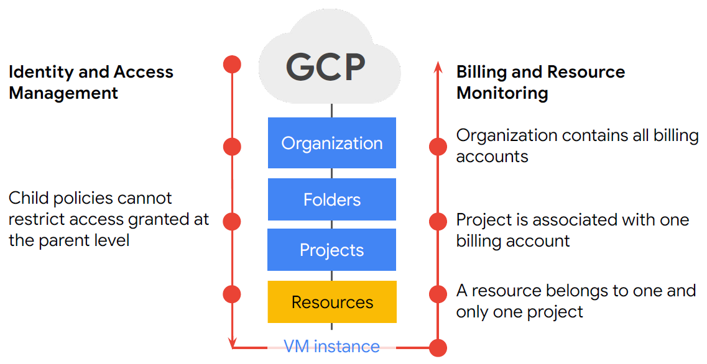

# Resource Manager

- Resource Manager
- Quotas
- Labels
- Billing

## Resource Manager

- Projects 
## Quotas
- Prevent runaway consumption in case of an error or malicious attack
- Prevent billing spikes or surprises
- Forces sizing consideration and periodic review

## Labels
Labels are utility for organizing Google Cloud resources.
Labels are user-defined strings and key-value formats that are used to organize resources and they can propagate true billing

Useful for
- teams
- components (Redis, frontend)
- owner
- environments
- state (inUse, readyForDeletion)

Labels ≠ Tags

Tags, on the other hand, are user-defined strings that are applied to instances only and are mainly used for networking, such as applying firewall rules.

## Billing
- Buget - Alerts
    - on mail or Pub/Sub
- Labels can help optimize GCP spend

