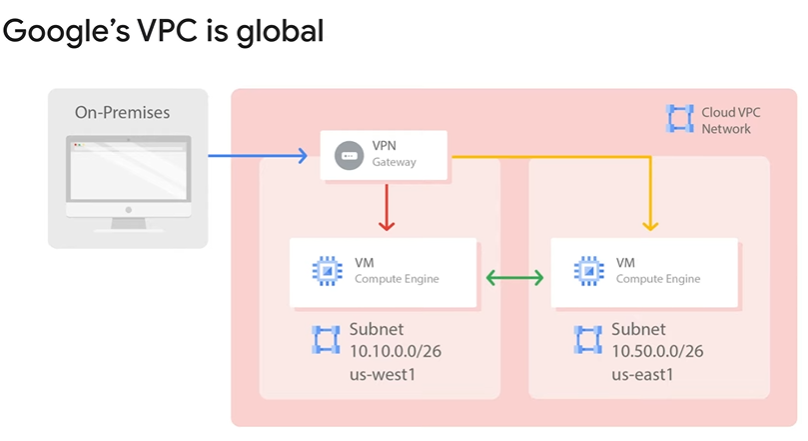

# Virtual Private Cloud

VPC Objects
- Projects - include all services including networks
    - associates objects and services with billing
    - contains networks - up to 5 that can be shared/peered
- Networks
    - Network types
        - default
            - provided for every project
            - a subnet is allocated for each region (non-overlapping)
            - presets for firewall rules
                - allow ingress `ssh`, `icmp`, `rdp` from anywhere
                - allow ingress traffic from within the default network for all protocols and ports
        - auto mode
            - one subnet from each region is created automatically
            - the default is actually a auto mode network
            - fixed subnets with /20 mask that can be expanded to a /16 mask
            - all under: 10.128.0.0/9 CIDR block
            - when new regions become available, new subnets are created automatically
        - custom mode
            - no default subnets
            - full control of IP ranges
            - can't have overlaps of the subnets
            - can convert auto-mode, unreversible
    - they are a construct of individual IP addresses within the network
    - has no IP address range
    - is global and spans on all available regions
    
- Subnets - allow you to divide networks
    - contains subnetworks (regional)
    - Example 1:
        - 
        - VMs A and B communicate over internal IPs even though they are in different regions
        - VMs C and D must communicate over external IPs even though they are in same regions
            - the traffic doesn't touch the real internet
            - it passes through Google Edge routers
            - has a different billing and security ramifications
    - Example 2:
        - 
        - you can use only an on-prem VPN to securely connect to both VMs from different regions
        - this reduces cost and net management complexity
        - subnets cand cross zones
        - 
        - every subnet has 4 reserved IP addresses in its primary IP range
            - .0, .1 - reserved for the network
            - last and second to last reserved for broadcast
        - a single firewall rule can be used for both VMs
        - you can expand subnets without re-creating instances
            - can have more VMs in one region as another
            - cannot overlap with other subnets
            - IP range must be unique valid CIDR block
            - new subnet IP ranges have to fall within valid IP ranges
            - can expand but not shrink
            - auto-mode can be expanded from /20 to /16
            - avoid large subnets - use what you actually need
        - Demo: Expand subnet
            - subnet with /29 - 4 VMs created, try to create one more
            - expand network to /23
            - instance creation resumed and succeeded
- Regions - Google Datacenters
- Zones
- IP addresses - internal, external, ranges
    - each VM can have 2 IPs: 
        - internal 
            - only this can be viewed inside the machine `ifconfig`
            - internal assigned by DHCP, lease 24h
            - symbolic name registered in an internal network-scoped DNS that translates the name into the internal IP
                - can translate VM names and URLs inside the same network
                - can't translate from different networks
        - external(optional) types:
            - assigned from pool (ephemeral)
            - reserved (static) - this costs more unused than an ephemeral one
            - Bring your own IP
                - need to own and bring a /24 block
            - unknown to the internals of the VM
    - there are some physical hardware limitations - check quotas (per region/
    zone)
    - DNS resolution for internal addresses
        - each instance has a hostname that can be resolved to an internal IP address
            - the hostname is the same as the instance name
            - FQDN (fully qualified domain name)is:
                - [hostname].[zone].c.[project-id].internal 
        - name resolutions is handled by internal DNS resolver:
            - provided as part of Compute engine (169.254.169.254)
            - configured for use on instance via DHCP
            - provides answer for internal and external addresses
        - VMs don't know about the external IP but have a mapping between external and internal
    - DNS resolution for external addresses
        - Instances with external IP addresses can allow connection from hosts outside the project
            - users connect directly using external IP addresses
            - admins can publish public DNS records pointing to the instance (not automatically)
        - DNS record for external addresses can be published using external DNS servers
        - DNS zone can be hosted using Cloud DNS
    - **Cloud DNS**
        - scalable, reliable, managed DNS in Google
        - translate domain names into IP addresses
        - low latency, high availability (SLA 100% uptime)
        - manageable via UI, cli, API
    - Alias IP ranges
        - define alias IP for different services/containers inside a VM
    - [IP Ranges list](https://www.gstatic.com/ipranges/cloud.json)        
- Routes
    - Every network has:
        - routes that let instances in a network send traffic directly to each other
        - a default route that directs packets to destinations that are outside the network
    - Firewall rules must also allow the packet
    - manually created networks don't have this rules
    - Routes map traffic to destination networks
        - apply to traffic egressing a VM
        - forward traffic to most specific route
        - are created when a subnet is created
        - enable VMs on a same network to communicate
        - destination is in CIDR notation
        - traffic is delivered only if it also matches a firewall rule
- Firewall routes
    - protect your VM instances from unapproved connections
        - VPC network functions as a distributed firewall
        - firewall rules are applied to the network as a whole
        - connections are allowed or denied at the instance level
        - firewall rules are stateful - allow bidirectional communication once a session is established
        - an implied *deny all ingress*  and *allow all egress* rules exist if none defined
        - 
        - 
        - 
- Pricing
    - 
    - Exceptions
        - ingress when a LB does processing
    - 
- Common network designs
    - deploy in multiple zones of the same region
        - increase availability
        - prevent issues due to hardware and software failures
    - deploy in multiple regions
        - globalization
        - better latency
        - lower network costs
    - recommendation: assign only internal IP addresses whenever possible
    - use **Cloud NAT** for provisioning instances without public IP addresses
        - lets them access internet in a controlled and efficient manner
    - allow Private Google Access for instances that have only internal IP
        - on a subnet basis
        - allows access to Google services without external IP
        

