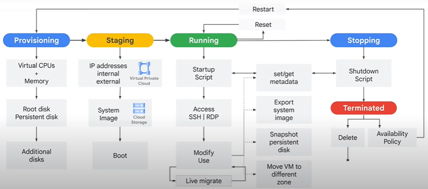
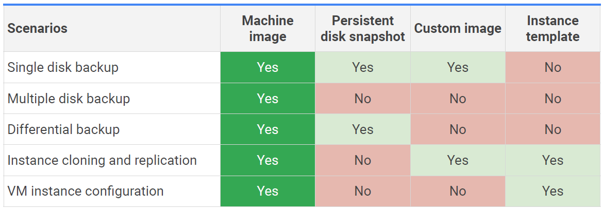
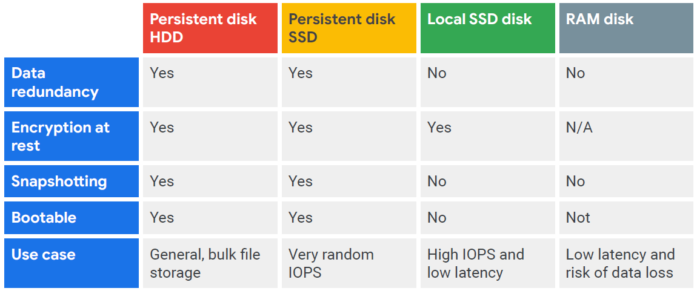
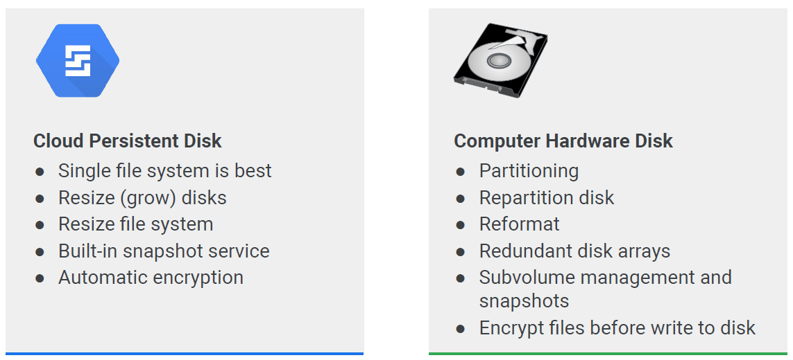

# Virtual machines

## Compute engine
- the most flexibility for your app
- IaaS model
- Server autoscaling
- General workloads

Machine types
- preconfigured
- custom

Network throughput 
- up to 2Gbps per vCPU
- theoretical max 32Gbps with 16 vCPU or 100 Gbps with T2 or V100 GPUs

> a vCPU is equal to 1 hardware hyper-thread

## Storage
- standard - higher capacity / $
- SSD - higher number of IOPs / $
- Local SSD 
    - higher throughput & low latency
    - phisically attached to the phisical hardware
    - persisted only until you stop/delete, often used as swap
    - up to 8 separate 375GB local SSD - max 3TB per instance
- standard & SSD up to 257 TB per instance
- different pricing

## Networking
- default, custom networks
- inbount/outbond firewall rules
    - ip based
    - instance/group tags
- load balancing
    - regional HTTP load balancing
    - network load balancing - does not require pre-warming

## Creation
- name
- region - zone
- machine type
- boot disk - image & storage: standard/ssd
- (optional) additional disk - standard/ssd/local ssd (max8)
- `gcloud beta compute instances create`

#### VMs

## Availability policy: automatic changes
( Scheduling Options in SDK/API)
- Provisioning model
    - Standard
    - Spot
- VM time limit: in hours or at a specific date
- Automatic restart (ON/OFF)
    - due to crash or maintenance event
        - not preemption or a user-initiated terminate
- On host maintenance
    - Migrate VM - Live migration
    - Terminate VM

## VM Manager - Patch management
- keep infra up to date
- reduce risk of security vulnerabilities
Tasks
- create patch aprovals
- setup flexible scheduling
- apply advanced patch configuration settings
- manage patches from a cerntralized interface

> for stopped instances you  could pay for: Attached disks and Reserved IP addresses

## Machine type Structure
Machine family -> Machine series -> Machine type

### Machine family
- General purpose
    - best price-performance with the most flexible vCPU to memory ratios
    - E2 - cost -optimized day to day computing
        - lowest price especially with commited-use discounts
        - 2 to 32 CPUs
        - 0.5 to 8GB memory/vCPU
        - good for: web servers, small-medium databases, dev/test environments, app serving, back office apps, microservices, virtual desktops
        - similar to N1 VMs
        - shared-core VMs
    - N2, N2D, N1 - balanced price/performance
        - good for: E2 + medium-large databases, cache, media/streaming
        - up to 128 vCPU
        - 0.5 to 8GB of memory per vCPU
        - Cascade Lake is the default processor up to 80 vCPU
        - Ice Lake is the default for larger types and specific regions
        - N2D - AMD based - up to 224 vCPU
    - Tau T2D - scale out optimized - best performance/cost for scaling
        - 3rd Gen AMD Epic processors
        - good for: scale-out workloads, web serving, containerized microservice, media transcoding, large-scale Java apps
        - up to 60vCPU
        - 4GB of memory per vCPU
        - good for GKE
- Compute-optimized
    - best for compute intensive workloads
    - C2 - ultra high performance
        - good for: compute-bound workloads, high-performance,  web serving, Gaming (AAA game servers), Ad serving, high perf computing, media transcoding, AI/ML
        - up to 3.8 Ghz all-core turbo
        - 4 to 60 vCPU, up to 240 GB memory and can attach up to 3TB of local storage
    - C2D - largest VM sizes
        - from 2 to 112 vCPU, 4GB of memory per vCPU
        - 3rd Generation AMD Epyc Millan
- Memory-optimized
    - lowest cost per GM memmory
    - for tasks that require higher memory-to-vCPU rations
    - 30% sustained use discounts, 60% for three-year commitments
    - M1 - up to 4TB mem
        - good for: medium in-memory database like SAP HANA, in-memoty databases and analytics, MS SQL Servers and similar dbs, business warehousing
    - M2 - up to 12TB
        - good for: same as M1 + large in-memory databases such as SAP HANA
- Accelerator-optimized
    - A2
        - massively paralelized computation
        - CUDA compute workloads - ML training
        - high performance computing
        - 12 to 96 vCPU and up to 1360 GB mem
        - each machine has a fixed (up to 16) NVIDIA Ampere A100 GPUs
        - a A100 GPU has 40GB of GPU memory
- Custom machine types
    - no predefined similar type
    - need more memory or CPU
    - costs slightly more
    - there are some limitation
    - CPU 1 or even
    - memory between 0.9 and 6.5 per vCPU (can be extended)
    - total memory must be multiple of 256MB

### Choosing Regions
- each zone suports a combination of: Ivy Bridge, Sandy Bridge, Haswell, Broadwell, and Skylake platforms

### Pricing
- Per second billing, minimum 1min for each vCPU, GPU and GB of memory
- Discounts - can't be combined
    - sustained use - per month
        - up to 30% (N1), up to 20% (N2, N2D)
        - discounts reset at the end of the month
        - applied at vCPU/mem level
    - committed use (1-3y) - up to 57% for most tyes, up to 70% for memory-optimized
    - preemptible VM instances
        - can be terminated if Compute Engine needs those resources for other tasks
        - preemptible - max 24h
        - spot - no time limit
        - discount from 60 to 91%
        
- VM sizes recommendation after 24h of creation
- Free Usage Limits exist 

### Preemptible VMs
- Lower price for interruptible service (up to 91%)
- VMs can be terminated at any time
    - no charge if terminated in the first minute
    - 24h max lifetime
    - 30 second terminate warning, not guaranteed
        - time for a shutdown script
    - No live migrate; no auto restart
- good for batch processing

## Spot VMs
- latest version of preemtible
- no minimum or maximum runtime
- no live migrate; no auto restart
- normally easier to get for smaller machines

### Sole-tenant nodes
- physically isolate workloads
- physical Compute Engine server that is dedicated to hosting VM instances only for your specific project
- good for
    - payment processing that needs to be isolated for complience requirements
    - existing operating system licenses

### Shielded VMs
- verifiable integrity to your VMs
- can't be compromised by boot or kernel-level malware or rootkits

### Confidential VMs
- allows you to encrypt data in use, while it's being processed
- a type of N2D
- uses AMD Secure Encrypted Virtualization
- google doesn't have access to the encryption keys

## Images
Includes
- Boot loader
- Operating system
- File system structure
- Software
- Customization

Types
- Public base images
    - Google, third-party vendors and community; Premium (p)
    - Linux: CentOS, CoreOS, Debian, RHEL(p) etc
    - Windows: Win Server 2019(p), 2016(p), 2012(p), SQL Server(p)
- Custom images
    - Create new image from VML pre-configured and installed
    - Import from on-prem, other cloud
    - Managtement features

### Machine images
- A machine image is a compute engine resource that stores all the configuration, metadata, permissions and data from one or more disks required to create a virtual machine instance.

## Disk options
- VMs comes with a single root persistent disk loaded with a bootable image 
    - durable image - survirves termination
    - durable to VM deletion only if you disable delete boot disk

### Persistent disks
- attached to a VM through the network interface
- can survirve VM terminate
- bootable
- can make snapshots
- performance: scales with size
- can be dynamicly resized while running
- can be attached in read only mode to multiple VMs - share static data, cheaper than replication
- Zonal persistent disks offers efficient, reliable block storage
- Regional persistent disks provide active-active disk replication across two zones in the same region
- Zonal or Regional
    - pd-standard - backed by a HDD
    - pd-ssd - backed by SSD
    - pd-balanced - on SSDs
    - pd-extreme - for high-end database workloads, you can specifiy desired IOPS
- Encryption keys:
    - Google-managed
    - Customer-managed
    - Customer-supplied
- Local SSDs - phisically attached to a VM
    - efemeral
    - more IOPS
    - up to 8 x 375GB - max 3TB
- RAM disk
    - use `tmpfs`
    - Faster than local dhisk, slower than memory
    - very volatile, erase on stop or restart
- Maximum persisten disks
    - 16 for Shared-core
    - 128 for the rest
- Throughput shares the same bandwith as Disk I/O - remember that if you need a large amount of persistent disks

**Persisten disk management differences**

## Common actions
- Metadata and Scripts
    - during: Boot, Run, Maintenance, Shutdown
- Move vm
    - Automated proces (within region)
        - `gcloud compute instance move`
        - update references to VM; not automatic
    - Manual process (between regions)
        - Snapshot all persistent disks
        - create new persistent disks in estination zone restored from snapshots
        - create new VM in destination zone and attac new persistent disks
        - Assign static IP to new VM
        - Update references to VM
        - Delete the snapshors, original disks and original VM
- Resize persistent disk
    - can grow, never shrink

### Snapshots
- Backup data in Cloud Storage
- migrate between zones
- can e used to transfer from HDD to SSD
- not available on local SSD
- create incremental backups to Cloud Storage
    - not visible in buckets
    - consider cron jobs for periodic incremental backup

