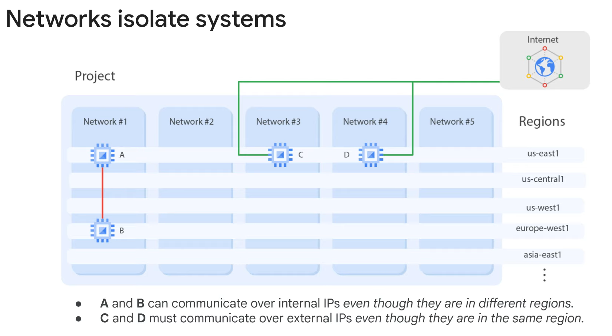

# Virtual Private Cloud

VPC Objects
- Projects - inlcude all services including networks
    - associates objects and services with billing
    - contains networks - up to 5 that can be shared/peered
- Networks
    - Network types
        - default
            - provided for every project
            - a subnet is alocated for each region (non-overlaping)
            - presets for firewall rules
                - allow ingress ssh, icmp, rdp from anywhere
                - allow ingress traffic from within the default network for all protocols and ports
        - auto mode
            - one subnet from each region is created automatically
            - the default is actually a auto mode network
            - fixed subnets with /20 mask that can be expanded to a /16 mask
            - all under: 10.128.0.0/9 CIDR block
            - when new regions become available, new subnets are created automatically
        - custom mode
            - no default subnets
            - full control of IP ranges
            - can't have overlaps of the subnets
            - can convert automode, unreversable
    - they are a construct of individual IP addresses within the network
    - has no IP address range
    - is global and spans on all available regions
    - contains subnetworks (regional)
    - Example 1:
        - 
        - VMs A and B communicate over internal IPs even though they are in different regions
        - VMs C and D must communicate overexternal IPs even though they are in same regions
            - the traffic doesn't touch the real internet
            - it passes through Google Edge routers
            - has a different billing and security ramifications
- Subnets - allow you to devide networks
- Regions - Google Datacenters
- Zones
- IP addresses - internal, external, ranges
- Routes
- Firewall routes

